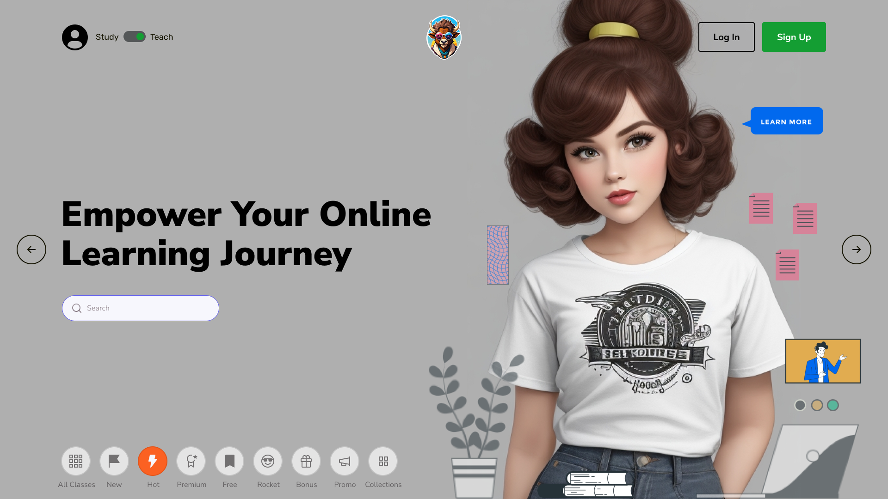

**Enhancing User Experience: Key Guidelines for Effective Website Design**

#website #landings #chatbots #marketing #classes #quizzes #notifications #admin #Iconography #Typography #DesignTokens #roadmap #website #Guidelines #Accessibility #UserOnboarding #MicrocopyGuidelines 
`functions:`  #analytics #management #tasks #communications #design 

---

**Mastering Design Fundamentals: Iconography, Typography, and Design Tokens**

In the world of design, attention to detail is key to creating intuitive and impactful products. 

- **Iconography**: Icons are more than just decorative elements; they’re symbols that can instantly communicate functionality or content. When used meaningfully and consistently, icons enhance user experience by offering quick, recognisable references that help users navigate interfaces with ease.
  
- **Typography**: Typography plays a critical role in how users engage with your content. By establishing a clear hierarchy and contrasting styles, typography not only enhances readability but also contributes to the structure and identity of your product. It's a powerful tool for expressing brand character and presence.
  
- **Design Tokens**: These are variables that store foundational values for your design system, such as color, typography, and spacing. By implementing design tokens, you ensure consistency throughout your components, allowing changes to resonate seamlessly across your entire design system.

Whether you’re building from scratch or refining an existing product, mastering these elements is essential for a cohesive and user-friendly design system.

Here’s a blog description that incorporates your provided content:

---

![[Frame 77.png]]

**Enhancing User Experience: Key Guidelines for Effective Website Design**

In the realm of web design, a thoughtful approach is essential for creating an engaging and user-friendly experience. Here’s how various elements contribute to effective design:

- **Website Guidelines**: Establishing guidelines for common UX patterns ensures that your organization maintains a consistent approach across all platforms. This consistency not only enhances user experience but also strengthens brand identity.

- **Accessibility**: Accessibility guidelines are crucial for creating inclusive designs. By leveraging color, hierarchy, and assistive technologies, you can enhance usability for all users, ensuring that everyone can interact with your product seamlessly.

- **User Onboarding**: A well-structured onboarding process is key to helping users navigate your product or its new features. Providing a positive experience from the start fosters engagement and encourages long-term use.

- **Microcopy Guidelines**: Effective writing within your design system is essential. By considering platform conventions and best practices, you can create standard microcopy that resonates with users and supports their journey.

![[Frame 27 (2).png]]

### Cards as a Versatile Component

Cards are an invaluable element in web design, providing a way to group information about subjects and related actions. Key features include:

- **Flexibility**: Cards must accommodate various types of content, making them one of the most utilized components in any product.
  
- **Structured Information**: Maintaining a specific structure within cards ensures product consistency and enhances usability.

- **Media Support**: Cards can effectively integrate media content, either with a full-width area atop the card or a full-height area on the side.

- **Supplementary Actions**: Cards can include actions at their base or be tappable to represent an action.

- **Responsiveness**: On mobile devices, cards often take up the full width to optimize space and enhance content accessibility.

![[Frame 27 (1) 1.png]]
### Layout and Color

- **Layout**: A well-thought-out layout, utilizing grids and consistent spacing, significantly improves user scanning and content understanding.

- **Color**: Purposeful color palettes do more than showcase your brand; they communicate effectively with users. By adding meaning to your interface, color can help establish intuitive design patterns.

By focusing on these guidelines and principles, you can create websites and landing pages that not only captivate users but also provide a seamless and engaging experience.

